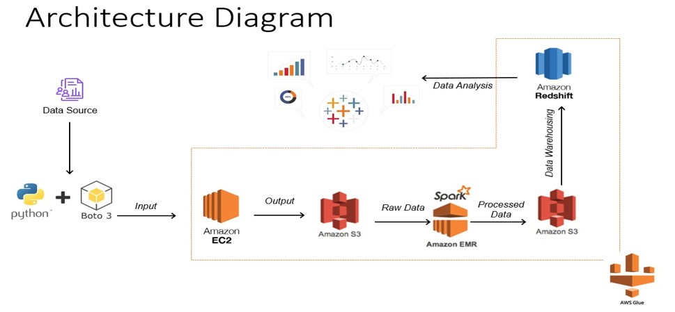

# 📊 Stack Overflow Posts Analysis Project

## 📌 Overview

This project provides a **comprehensive analysis of Stack Overflow posts** using **Big Data frameworks** like **Apache Spark, AWS Glue, and Redshift**. The goal is to extract insights into developer trends, commonly used technologies, and key challenges in software development.

We use **PySpark and AWS services** to process the large Stack Overflow dataset efficiently. **Data is extracted, transformed, and analyzed**, leading to meaningful visualizations in **Tableau**.

---

## 🚀 Technologies Used

- **Cloud & Big Data Tools:**
  - 🔥 Apache Spark & PySpark
  - ☁️ AWS (EC2, S3, EMR, Glue, Athena, Redshift)
- **Data Processing & Analysis:**
  - 🐍 Python (Pandas, NumPy)
  - 💾 SQL (Athena, Redshift)
- **Visualization:**
  - 📊 Tableau

---

## 🔹 Project Workflow

### **1️⃣ Data Extraction & Storage**
- Stack Overflow dataset is extracted from **Stack Exchange archive**.
- Data is uploaded to an **AWS S3 bucket**.

### **2️⃣ Data Processing**
- **AWS Glue & PySpark** are used to clean and transform data.
- Data is converted from **XML to Parquet** format.

### **3️⃣ Data Analysis**
- Transformed data is loaded into **AWS Redshift**.
- SQL queries are run in **Athena** for deeper insights.

### **4️⃣ Data Visualization**
- Insights are **visualized in Tableau**.
- Interactive dashboards help in understanding developer trends.

---

## 🔍 Key Insights

- **Most popular programming languages** over time.
- **Developer response times** to Stack Overflow questions.
- **Trends in commonly asked questions** and **most discussed topics**.

---

